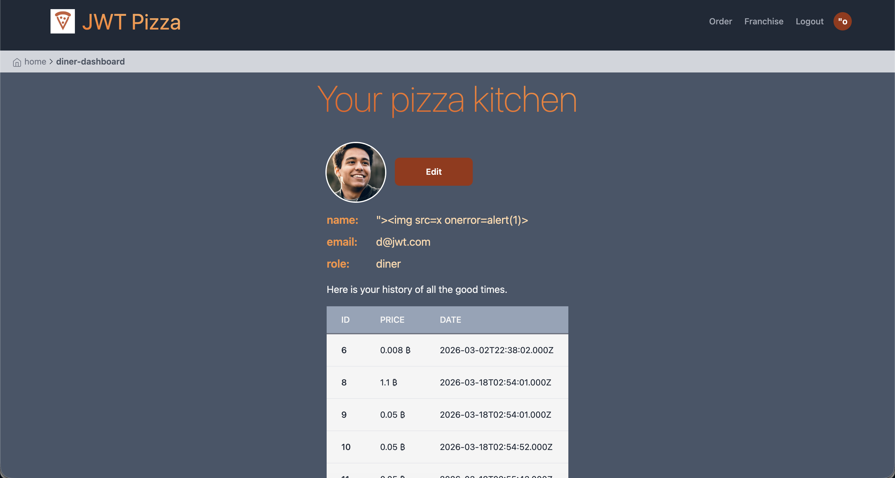
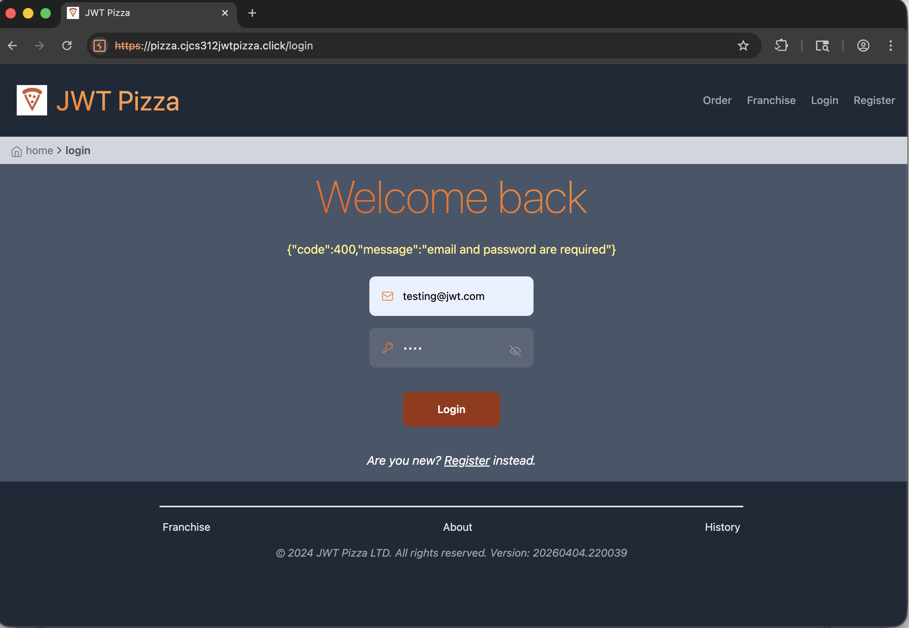

# Self Attacks - Owen Larson

## Self Attack 1: JWT Tampering

| Item           | Result       |
|----------------|---------------|
| Date           | April 8, 2026     |
| Target         | pizza.owenlarson.click    |
| Classification | Identification and Authentication Failures      |
| Severity       | 0                |
| Description    | Tried tampering with the auth token JWT by decoding, and changing "diner" to "admin" and re-encoding. Didn't work. The server rejected the subsequent requests made with the new auth token with a 401 error. |
| Images         | N/A         |
| Corrections    | N/A                |

## Self Attack 2: Cross Site Scripting

| Item           | Result                                                                         |
| -------------- | ------------------------------------------------------------------------------ |
| Date           | April 8, 2026                                                                 |
| Target         | pizza.owenlarson.click                                                       |
| Classification | XSS (Cross Site Scripting)                                            |
| Severity       | 0                                                                              |
| Description    | Attempted to change display name to `` and also tried `">` to see if injecting JavaScript code was possible. It displayed these names as text no problem.                |
| Images         |     Name displays as injected script without an issue. |
| Corrections    | N/A                                                          |

## Self Attack 3: Delete Franchise w/o authentication

| Item           | Result                                                                         |
| -------------- | ------------------------------------------------------------------------------ |
| Date           | April 8, 2026                                                                  |
| Target         | pizza.owenlarson.click                                                       |
| Classification | Broken Access Control                                                                      |
| Severity       | 3                                                                              |
| Description    | The delete franchise endpoint is not authenticated on the backend. This means literally anyone can send a delete franchise request without an auth token and delete a franchise.                |
| Images         | N/A |
| Corrections    | Enable authentication on the delete franchise endpoint on the server.|

## Self Attack 4: Login with empty password

| Item           | Result                                                                         |
| -------------- | ------------------------------------------------------------------------------ |
| Date           | April 8, 2026                                                                 |
| Target         | pizza.owenlarson.click                                                       |
| Classification | Identification and Authentication Failures                              |
| Severity       | 3                                                                              |
| Description    | If you intercept an login request and change the password to an empty string, it works, and returns you an auth token. This means anyone who knows/can guess an admin email can get an admin auth token to do whatever they want.  |
| Images         | N/A |
| Corrections    | Validate inputs on the backend (don't allow empty password), and ensure an empty string never matches a hashed password     |

## Self Attack 5: SQL Injection

| Item           | Result                                                                         |
| -------------- | ------------------------------------------------------------------------------ |
| Date           | April 8, 2026                                                                 |
| Target         | pizza.owenlarson.click                                                       |
| Classification | Injection                                                                      |
| Severity       | 3                                                                              |
| Description    | Conducted a SQL injection attack on the update user endpoint. I send the following payload when logged in as user id 5. This was used to show proof of concept as I was able to inject SQL and change the email of another user (user id 6) `{"name": "attacker', email='pwned@example.com' WHERE id=6 -- ","email": "attacker@jwt.com"}`               |
| Images         | N/A |
| Corrections    | Don't allow user input strings straight into SQL queries. Sanitize all inputs beforehand.      |

## Peer Attack 1: JWT Tampering

| Item           | Result       |
|----------------|---------------|
| Date           | April 9, 2026     |
| Target         | pizza.cjcs312jwtpizza.click   |
| Classification | Identification and Authentication Failures      |
| Severity       | 0                |
| Description    | Tried tampering with the auth token JWT by decoding, and adding an "admin" role and re-encoding the token. I then tried to use that token on subsequent requests to assume admin credentials. It did not work. The server rejected the subsequent requests made with the new auth token as unauthorized. |
| Images         | N/A         |
| Corrections    | N/A                |

## Peer Attack 2: Cross Site Scripting

| Item           | Result                                                                         |
| -------------- | ------------------------------------------------------------------------------ |
| Date           | April 9, 2026                                                                 |
| Target         | pizza.cjcs312jwtpizza.click                                                       |
| Classification | XSS (Cross Site Scripting)                                            |
| Severity       | 0                                                                              |
| Description    | Attempted to change display name of a user to `` and also tried `">` to see if injecting JavaScript code into the frontent was possible. It displayed these names as text without a problem.                |
| Images         | N/A  |
| Corrections    | N/A                  |

## Peer Attack 3: Delete Franchise w/o Authentication

| Item           | Result                                                                         |
| -------------- | ------------------------------------------------------------------------------ |
| Date           | April 9, 2026                                                                  |
| Target         | pizza.cjcs312jwtpizza.click                                                       |
| Classification | Broken Access Control                                                                      |
| Severity       | 0                                                                              |
| Description    | Tried to delete a franchise without authentication, which was initially allowed on my site. I got an authenticated request and the franchise was not deleted.                |
| Images         | N/A |
| Corrections    | N/A |

## Peer Attack 4: Login with empty password

| Item           | Result                                                                         |
| -------------- | ------------------------------------------------------------------------------ |
| Date           | April 9, 2026                                                                 |
| Target         | pizza.cjcs312jwtpizza.click                                                       |
| Classification | Identification and Authentication Failures                              |
| Severity       | 0                                                                              |
| Description    | Tried intercepting the login request and changing the password to an empty string. Got a 400 error where password is not allowed to be empty.  |
| Images         |  |
| Corrections    | N/A    |

## Peer Attack 5: SQL Injection

| Item           | Result                                                                         |
| -------------- | ------------------------------------------------------------------------------ |
| Date           | April 9, 2026                                                                 |
| Target         | pizza.cjcs312jwtpizza.click                                                       |
| Classification | Injection                                                                      |
| Severity       | 0                                                                              |
| Description    | Conducted a SQL injection attack on the update user endpoint. I send the following payload when logged in as a different user than the id I specified. This worked on my site before I hardened it but did not work on my peer's site. `{"name": "attacker', email='pwned@example.com' WHERE id=6 -- ","email": "attacker@jwt.com"}`               |
| Images         | N/A |
| Corrections    | N/A   |

